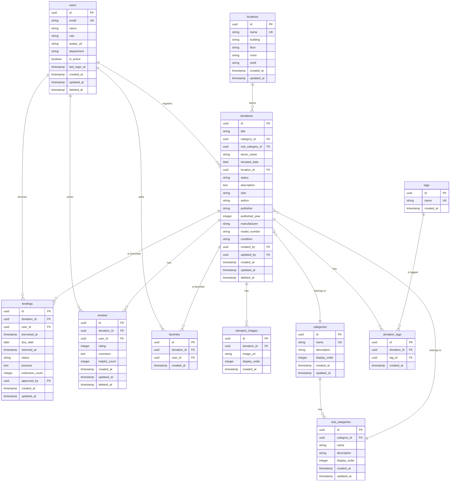

# 社内寄贈物管理システム - データベース設計書

## 1. 概要

### 1.1 データベース基本情報
- **DBMS**: PostgreSQL 15
- **ホスティング**: Supabase
- **文字エンコーディング**: UTF-8
- **タイムゾーン**: Asia/Tokyo

### 1.2 設計方針
- 第3正規形を基本とした設計
- UUID を主キーとして採用（分散システム対応）
- 論理削除の実装（deleted_at カラム）
- 監査証跡の確保（created_at, updated_at, created_by, updated_by）
- Row Level Security (RLS) によるアクセス制御

## 2. ER図



## 3. テーブル定義

### 3.1 users（ユーザー）
| カラム名 | データ型 | NULL | デフォルト | 説明 |
|---------|---------|------|-----------|------|
| id | UUID | NO | gen_random_uuid() | 主キー |
| email | VARCHAR(255) | NO | - | メールアドレス（ユニーク） |
| name | VARCHAR(100) | NO | - | 氏名 |
| role | VARCHAR(20) | NO | 'user' | 権限（user/admin/system） |
| avatar_url | VARCHAR(500) | YES | NULL | アバター画像URL |
| department | VARCHAR(100) | YES | NULL | 部署名 |
| is_active | BOOLEAN | NO | true | アクティブフラグ |
| last_login_at | TIMESTAMP | YES | NULL | 最終ログイン日時 |
| created_at | TIMESTAMP | NO | CURRENT_TIMESTAMP | 作成日時 |
| updated_at | TIMESTAMP | NO | CURRENT_TIMESTAMP | 更新日時 |
| deleted_at | TIMESTAMP | YES | NULL | 削除日時（論理削除） |

### 3.2 categories（カテゴリ）
| カラム名 | データ型 | NULL | デフォルト | 説明 |
|---------|---------|------|-----------|------|
| id | UUID | NO | gen_random_uuid() | 主キー |
| name | VARCHAR(50) | NO | - | カテゴリ名（ユニーク） |
| description | TEXT | YES | NULL | 説明 |
| display_order | INTEGER | NO | 0 | 表示順 |
| created_at | TIMESTAMP | NO | CURRENT_TIMESTAMP | 作成日時 |
| updated_at | TIMESTAMP | NO | CURRENT_TIMESTAMP | 更新日時 |

### 3.3 sub_categories（サブカテゴリ）
| カラム名 | データ型 | NULL | デフォルト | 説明 |
|---------|---------|------|-----------|------|
| id | UUID | NO | gen_random_uuid() | 主キー |
| category_id | UUID | NO | - | カテゴリID（外部キー） |
| name | VARCHAR(50) | NO | - | サブカテゴリ名 |
| description | TEXT | YES | NULL | 説明 |
| display_order | INTEGER | NO | 0 | 表示順 |
| created_at | TIMESTAMP | NO | CURRENT_TIMESTAMP | 作成日時 |
| updated_at | TIMESTAMP | NO | CURRENT_TIMESTAMP | 更新日時 |

### 3.4 locations（保管場所）
| カラム名 | データ型 | NULL | デフォルト | 説明 |
|---------|---------|------|-----------|------|
| id | UUID | NO | gen_random_uuid() | 主キー |
| name | VARCHAR(100) | NO | - | 場所名（ユニーク） |
| building | VARCHAR(50) | YES | NULL | 建物名 |
| floor | VARCHAR(20) | YES | NULL | 階数 |
| room | VARCHAR(50) | YES | NULL | 部屋名 |
| shelf | VARCHAR(50) | YES | NULL | 棚番号 |
| created_at | TIMESTAMP | NO | CURRENT_TIMESTAMP | 作成日時 |
| updated_at | TIMESTAMP | NO | CURRENT_TIMESTAMP | 更新日時 |

### 3.5 donations（寄贈物）
| カラム名 | データ型 | NULL | デフォルト | 説明 |
|---------|---------|------|-----------|------|
| id | UUID | NO | gen_random_uuid() | 主キー |
| title | VARCHAR(255) | NO | - | 品名 |
| category_id | UUID | NO | - | カテゴリID（外部キー） |
| sub_category_id | UUID | YES | NULL | サブカテゴリID（外部キー） |
| donor_name | VARCHAR(100) | YES | NULL | 寄贈者名 |
| donated_date | DATE | NO | - | 寄贈日 |
| location_id | UUID | NO | - | 保管場所ID（外部キー） |
| status | VARCHAR(20) | NO | 'available' | ステータス |
| description | TEXT | YES | NULL | 説明 |
| isbn | VARCHAR(20) | YES | NULL | ISBN（書籍用） |
| author | VARCHAR(200) | YES | NULL | 著者（書籍用） |
| publisher | VARCHAR(100) | YES | NULL | 出版社（書籍用） |
| published_year | INTEGER | YES | NULL | 出版年（書籍用） |
| manufacturer | VARCHAR(100) | YES | NULL | メーカー（備品用） |
| model_number | VARCHAR(100) | YES | NULL | 型番（備品用） |
| condition | VARCHAR(20) | YES | NULL | 状態（new/good/fair/poor） |
| created_by | UUID | NO | - | 作成者ID（外部キー） |
| updated_by | UUID | YES | NULL | 更新者ID（外部キー） |
| created_at | TIMESTAMP | NO | CURRENT_TIMESTAMP | 作成日時 |
| updated_at | TIMESTAMP | NO | CURRENT_TIMESTAMP | 更新日時 |
| deleted_at | TIMESTAMP | YES | NULL | 削除日時（論理削除） |

### 3.6 donation_images（寄贈物画像）
| カラム名 | データ型 | NULL | デフォルト | 説明 |
|---------|---------|------|-----------|------|
| id | UUID | NO | gen_random_uuid() | 主キー |
| donation_id | UUID | NO | - | 寄贈物ID（外部キー） |
| image_url | VARCHAR(500) | NO | - | 画像URL |
| display_order | INTEGER | NO | 0 | 表示順 |
| created_at | TIMESTAMP | NO | CURRENT_TIMESTAMP | 作成日時 |

### 3.7 lendings（貸出）
| カラム名 | データ型 | NULL | デフォルト | 説明 |
|---------|---------|------|-----------|------|
| id | UUID | NO | gen_random_uuid() | 主キー |
| donation_id | UUID | NO | - | 寄贈物ID（外部キー） |
| user_id | UUID | NO | - | ユーザーID（外部キー） |
| borrowed_at | TIMESTAMP | NO | CURRENT_TIMESTAMP | 貸出日時 |
| due_date | DATE | NO | - | 返却予定日 |
| returned_at | TIMESTAMP | YES | NULL | 返却日時 |
| status | VARCHAR(20) | NO | 'active' | ステータス |
| purpose | TEXT | YES | NULL | 利用目的 |
| extension_count | INTEGER | NO | 0 | 延長回数 |
| approved_by | UUID | YES | NULL | 承認者ID（外部キー） |
| created_at | TIMESTAMP | NO | CURRENT_TIMESTAMP | 作成日時 |
| updated_at | TIMESTAMP | NO | CURRENT_TIMESTAMP | 更新日時 |

### 3.8 reviews（レビュー）
| カラム名 | データ型 | NULL | デフォルト | 説明 |
|---------|---------|------|-----------|------|
| id | UUID | NO | gen_random_uuid() | 主キー |
| donation_id | UUID | NO | - | 寄贈物ID（外部キー） |
| user_id | UUID | NO | - | ユーザーID（外部キー） |
| rating | INTEGER | NO | - | 評価（1-5） |
| comment | TEXT | YES | NULL | コメント |
| helpful_count | INTEGER | NO | 0 | 役立った数 |
| created_at | TIMESTAMP | NO | CURRENT_TIMESTAMP | 作成日時 |
| updated_at | TIMESTAMP | NO | CURRENT_TIMESTAMP | 更新日時 |
| deleted_at | TIMESTAMP | YES | NULL | 削除日時（論理削除） |

### 3.9 favorites（お気に入り）
| カラム名 | データ型 | NULL | デフォルト | 説明 |
|---------|---------|------|-----------|------|
| id | UUID | NO | gen_random_uuid() | 主キー |
| donation_id | UUID | NO | - | 寄贈物ID（外部キー） |
| user_id | UUID | NO | - | ユーザーID（外部キー） |
| created_at | TIMESTAMP | NO | CURRENT_TIMESTAMP | 作成日時 |

### 3.10 tags（タグ）
| カラム名 | データ型 | NULL | デフォルト | 説明 |
|---------|---------|------|-----------|------|
| id | UUID | NO | gen_random_uuid() | 主キー |
| name | VARCHAR(50) | NO | - | タグ名（ユニーク） |
| created_at | TIMESTAMP | NO | CURRENT_TIMESTAMP | 作成日時 |

### 3.11 donation_tags（寄贈物タグ中間テーブル）
| カラム名 | データ型 | NULL | デフォルト | 説明 |
|---------|---------|------|-----------|------|
| id | UUID | NO | gen_random_uuid() | 主キー |
| donation_id | UUID | NO | - | 寄贈物ID（外部キー） |
| tag_id | UUID | NO | - | タグID（外部キー） |
| created_at | TIMESTAMP | NO | CURRENT_TIMESTAMP | 作成日時 |

## 4. インデックス設計

```sql
-- ユーザーテーブル
CREATE UNIQUE INDEX idx_users_email ON users(email) WHERE deleted_at IS NULL;
CREATE INDEX idx_users_role ON users(role);
CREATE INDEX idx_users_department ON users(department);

-- カテゴリテーブル
CREATE UNIQUE INDEX idx_categories_name ON categories(name);
CREATE INDEX idx_categories_display_order ON categories(display_order);

-- サブカテゴリテーブル
CREATE INDEX idx_sub_categories_category_id ON sub_categories(category_id);
CREATE INDEX idx_sub_categories_display_order ON sub_categories(display_order);

-- 保管場所テーブル
CREATE UNIQUE INDEX idx_locations_name ON locations(name);

-- 寄贈物テーブル
CREATE INDEX idx_donations_title ON donations(title);
CREATE INDEX idx_donations_category_id ON donations(category_id);
CREATE INDEX idx_donations_sub_category_id ON donations(sub_category_id);
CREATE INDEX idx_donations_location_id ON donations(location_id);
CREATE INDEX idx_donations_status ON donations(status);
CREATE INDEX idx_donations_donated_date ON donations(donated_date);
CREATE INDEX idx_donations_created_by ON donations(created_by);

-- 貸出テーブル
CREATE INDEX idx_lendings_donation_id ON lendings(donation_id);
CREATE INDEX idx_lendings_user_id ON lendings(user_id);
CREATE INDEX idx_lendings_status ON lendings(status);
CREATE INDEX idx_lendings_due_date ON lendings(due_date);

-- レビューテーブル
CREATE INDEX idx_reviews_donation_id ON reviews(donation_id);
CREATE INDEX idx_reviews_user_id ON reviews(user_id);
CREATE INDEX idx_reviews_rating ON reviews(rating);

-- お気に入りテーブル
CREATE UNIQUE INDEX idx_favorites_user_donation ON favorites(user_id, donation_id);

-- タグテーブル
CREATE UNIQUE INDEX idx_tags_name ON tags(name);

-- 寄贈物タグ中間テーブル
CREATE UNIQUE INDEX idx_donation_tags_donation_tag ON donation_tags(donation_id, tag_id);
```

## 5. 制約

### 5.1 外部キー制約
```sql
-- サブカテゴリ
ALTER TABLE sub_categories
  ADD CONSTRAINT fk_sub_categories_category
  FOREIGN KEY (category_id) REFERENCES categories(id);

-- 寄贈物
ALTER TABLE donations
  ADD CONSTRAINT fk_donations_category
  FOREIGN KEY (category_id) REFERENCES categories(id),
  ADD CONSTRAINT fk_donations_sub_category
  FOREIGN KEY (sub_category_id) REFERENCES sub_categories(id),
  ADD CONSTRAINT fk_donations_location
  FOREIGN KEY (location_id) REFERENCES locations(id),
  ADD CONSTRAINT fk_donations_created_by
  FOREIGN KEY (created_by) REFERENCES users(id),
  ADD CONSTRAINT fk_donations_updated_by
  FOREIGN KEY (updated_by) REFERENCES users(id);

-- 寄贈物画像
ALTER TABLE donation_images
  ADD CONSTRAINT fk_donation_images_donation
  FOREIGN KEY (donation_id) REFERENCES donations(id) ON DELETE CASCADE;

-- 貸出
ALTER TABLE lendings
  ADD CONSTRAINT fk_lendings_donation
  FOREIGN KEY (donation_id) REFERENCES donations(id),
  ADD CONSTRAINT fk_lendings_user
  FOREIGN KEY (user_id) REFERENCES users(id),
  ADD CONSTRAINT fk_lendings_approved_by
  FOREIGN KEY (approved_by) REFERENCES users(id);

-- レビュー
ALTER TABLE reviews
  ADD CONSTRAINT fk_reviews_donation
  FOREIGN KEY (donation_id) REFERENCES donations(id),
  ADD CONSTRAINT fk_reviews_user
  FOREIGN KEY (user_id) REFERENCES users(id);

-- お気に入り
ALTER TABLE favorites
  ADD CONSTRAINT fk_favorites_donation
  FOREIGN KEY (donation_id) REFERENCES donations(id) ON DELETE CASCADE,
  ADD CONSTRAINT fk_favorites_user
  FOREIGN KEY (user_id) REFERENCES users(id) ON DELETE CASCADE;

-- 寄贈物タグ
ALTER TABLE donation_tags
  ADD CONSTRAINT fk_donation_tags_donation
  FOREIGN KEY (donation_id) REFERENCES donations(id) ON DELETE CASCADE,
  ADD CONSTRAINT fk_donation_tags_tag
  FOREIGN KEY (tag_id) REFERENCES tags(id);
```

### 5.2 チェック制約
```sql
-- ユーザーロール
ALTER TABLE users
  ADD CONSTRAINT chk_users_role
  CHECK (role IN ('user', 'admin', 'system'));

-- 寄贈物ステータス
ALTER TABLE donations
  ADD CONSTRAINT chk_donations_status
  CHECK (status IN ('available', 'lending', 'maintenance', 'lost')),
  ADD CONSTRAINT chk_donations_condition
  CHECK (condition IN ('new', 'good', 'fair', 'poor'));

-- 貸出ステータス
ALTER TABLE lendings
  ADD CONSTRAINT chk_lendings_status
  CHECK (status IN ('active', 'returned', 'overdue', 'cancelled')),
  ADD CONSTRAINT chk_lendings_extension_count
  CHECK (extension_count >= 0 AND extension_count <= 2);

-- レビュー評価
ALTER TABLE reviews
  ADD CONSTRAINT chk_reviews_rating
  CHECK (rating >= 1 AND rating <= 5);
```

## 6. Row Level Security (RLS)

```sql
-- RLS有効化
ALTER TABLE users ENABLE ROW LEVEL SECURITY;
ALTER TABLE donations ENABLE ROW LEVEL SECURITY;
ALTER TABLE lendings ENABLE ROW LEVEL SECURITY;
ALTER TABLE reviews ENABLE ROW LEVEL SECURITY;
ALTER TABLE favorites ENABLE ROW LEVEL SECURITY;

-- ユーザーポリシー
CREATE POLICY "Users can view all active users" ON users
  FOR SELECT USING (deleted_at IS NULL);

CREATE POLICY "Users can update own profile" ON users
  FOR UPDATE USING (auth.uid() = id);

-- 寄贈物ポリシー
CREATE POLICY "All users can view active donations" ON donations
  FOR SELECT USING (deleted_at IS NULL);

CREATE POLICY "Admins can manage donations" ON donations
  FOR ALL USING (
    EXISTS (
      SELECT 1 FROM users
      WHERE users.id = auth.uid() AND users.role IN ('admin', 'system')
    )
  );

-- 貸出ポリシー
CREATE POLICY "Users can view own lendings" ON lendings
  FOR SELECT USING (user_id = auth.uid());

CREATE POLICY "Users can create own lendings" ON lendings
  FOR INSERT WITH CHECK (user_id = auth.uid());

CREATE POLICY "Admins can view all lendings" ON lendings
  FOR SELECT USING (
    EXISTS (
      SELECT 1 FROM users
      WHERE users.id = auth.uid() AND users.role IN ('admin', 'system')
    )
  );

-- レビューポリシー
CREATE POLICY "All users can view reviews" ON reviews
  FOR SELECT USING (deleted_at IS NULL);

CREATE POLICY "Users can create own reviews" ON reviews
  FOR INSERT WITH CHECK (user_id = auth.uid());

CREATE POLICY "Users can update own reviews" ON reviews
  FOR UPDATE USING (user_id = auth.uid());

-- お気に入りポリシー
CREATE POLICY "Users can manage own favorites" ON favorites
  FOR ALL USING (user_id = auth.uid());
```

## 7. ビュー定義

```sql
-- 寄贈物詳細ビュー
CREATE VIEW v_donation_details AS
SELECT 
  d.*,
  c.name as category_name,
  sc.name as sub_category_name,
  l.name as location_name,
  u.name as created_by_name,
  COALESCE(r.avg_rating, 0) as avg_rating,
  COALESCE(r.review_count, 0) as review_count,
  COALESCE(le.lending_count, 0) as total_lending_count
FROM donations d
  JOIN categories c ON d.category_id = c.id
  LEFT JOIN sub_categories sc ON d.sub_category_id = sc.id
  JOIN locations l ON d.location_id = l.id
  JOIN users u ON d.created_by = u.id
  LEFT JOIN (
    SELECT donation_id, AVG(rating) as avg_rating, COUNT(*) as review_count
    FROM reviews
    WHERE deleted_at IS NULL
    GROUP BY donation_id
  ) r ON d.id = r.donation_id
  LEFT JOIN (
    SELECT donation_id, COUNT(*) as lending_count
    FROM lendings
    GROUP BY donation_id
  ) le ON d.id = le.donation_id
WHERE d.deleted_at IS NULL;

-- 貸出履歴ビュー
CREATE VIEW v_lending_history AS
SELECT 
  l.*,
  d.title as donation_title,
  d.category_id,
  u.name as user_name,
  u.email as user_email,
  u.department as user_department,
  a.name as approved_by_name
FROM lendings l
  JOIN donations d ON l.donation_id = d.id
  JOIN users u ON l.user_id = u.id
  LEFT JOIN users a ON l.approved_by = a.id;
```

## 8. トリガー

```sql
-- 更新日時自動更新トリガー
CREATE OR REPLACE FUNCTION update_updated_at_column()
RETURNS TRIGGER AS $$
BEGIN
  NEW.updated_at = CURRENT_TIMESTAMP;
  RETURN NEW;
END;
$$ language 'plpgsql';

CREATE TRIGGER update_users_updated_at BEFORE UPDATE ON users
  FOR EACH ROW EXECUTE FUNCTION update_updated_at_column();

CREATE TRIGGER update_donations_updated_at BEFORE UPDATE ON donations
  FOR EACH ROW EXECUTE FUNCTION update_updated_at_column();

CREATE TRIGGER update_lendings_updated_at BEFORE UPDATE ON lendings
  FOR EACH ROW EXECUTE FUNCTION update_updated_at_column();

-- 貸出時の寄贈物ステータス更新トリガー
CREATE OR REPLACE FUNCTION update_donation_status_on_lending()
RETURNS TRIGGER AS $$
BEGIN
  IF TG_OP = 'INSERT' AND NEW.status = 'active' THEN
    UPDATE donations SET status = 'lending' WHERE id = NEW.donation_id;
  ELSIF TG_OP = 'UPDATE' AND NEW.status = 'returned' THEN
    UPDATE donations SET status = 'available' WHERE id = NEW.donation_id;
  END IF;
  RETURN NEW;
END;
$$ language 'plpgsql';

CREATE TRIGGER update_donation_status AFTER INSERT OR UPDATE ON lendings
  FOR EACH ROW EXECUTE FUNCTION update_donation_status_on_lending();
```

## 9. 初期データ

```sql
-- カテゴリマスタ
INSERT INTO categories (name, description, display_order) VALUES
  ('書籍', '技術書、ビジネス書など', 1),
  ('備品', 'PC周辺機器、文房具など', 2),
  ('その他', 'その他の寄贈物', 3);

-- サブカテゴリマスタ（書籍）
INSERT INTO sub_categories (category_id, name, display_order) VALUES
  ((SELECT id FROM categories WHERE name = '書籍'), 'プログラミング', 1),
  ((SELECT id FROM categories WHERE name = '書籍'), 'データベース', 2),
  ((SELECT id FROM categories WHERE name = '書籍'), 'インフラ', 3),
  ((SELECT id FROM categories WHERE name = '書籍'), 'AI・機械学習', 4),
  ((SELECT id FROM categories WHERE name = '書籍'), 'ビジネス', 5);

-- サブカテゴリマスタ（備品）
INSERT INTO sub_categories (category_id, name, display_order) VALUES
  ((SELECT id FROM categories WHERE name = '備品'), 'PC周辺機器', 1),
  ((SELECT id FROM categories WHERE name = '備品'), 'ケーブル類', 2),
  ((SELECT id FROM categories WHERE name = '備品'), '文房具', 3);

-- 保管場所マスタ
INSERT INTO locations (name, building, floor, room, shelf) VALUES
  ('本社3F共有書棚A', '本社', '3F', '共有スペース', 'A'),
  ('本社3F共有書棚B', '本社', '3F', '共有スペース', 'B'),
  ('本社5F会議室', '本社', '5F', '会議室1', '-'),
  ('別館2F倉庫', '別館', '2F', '倉庫', '-');

-- タグマスタ
INSERT INTO tags (name) VALUES
  ('初心者向け'),
  ('上級者向け'),
  ('新刊'),
  ('人気'),
  ('おすすめ');
```

## 10. バックアップ・リカバリ方針

### 10.1 バックアップ
- **頻度**: 日次（深夜2時）
- **保持期間**: 30日間
- **方式**: Supabase自動バックアップ

### 10.2 リカバリ
- **RPO (Recovery Point Objective)**: 24時間
- **RTO (Recovery Time Objective)**: 4時間
- **手順**: Supabaseダッシュボードからの復元

## 11. パフォーマンスチューニング

### 11.1 クエリ最適化
- 頻繁に使用するクエリの実行計画確認
- 適切なインデックスの追加
- N+1問題の回避

### 11.2 データ量見積もり
- ユーザー数: 1,000人
- 寄贈物数: 10,000件
- 月間貸出数: 500件
- 年間データ増加率: 20%

---

*作成日：2025年1月10日*
*更新日：2025年1月10日*